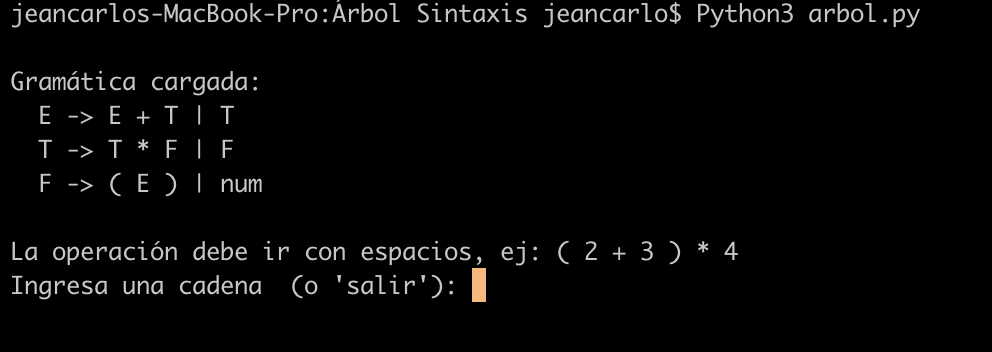
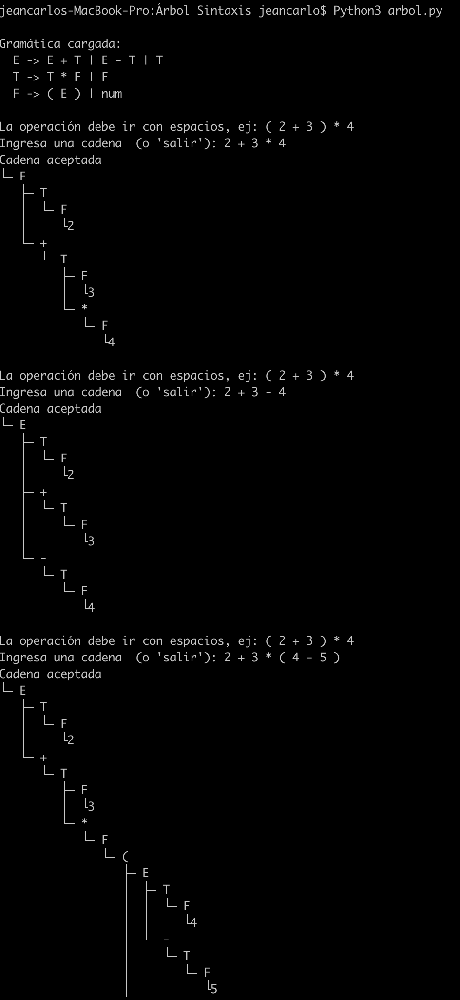
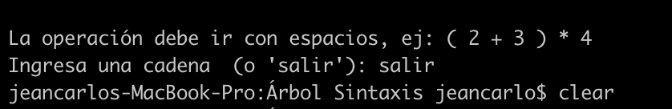

## Árbol de Sintaxis 

Para este ejercicio se desarrolló un código en el lenguaje python que recibe y lee un archivo txt llamado gracias.txt que contiene una gramática para la interpretación básica de operaciones aritméticas como el operador suma, multiplicación y el uso de paréntesis. 

La gramática que se encuentra en dicho documento es: 

E -> E + T | T
T -> T * F | F
F -> ( E ) | num

## Pasos para compilar el analizador sintáctico 

1. Primero se deben descargar los 2 archivos adjuntos en el git arbol.py y gra.txt 

2. Después de tener los archivos descargados en lo posible deben estar en una misma carpeta del nombre de preferencia del usuario

3. Abrir dicha carpeta como terminal y ejecutar el siguiente comando: Python3 arbol.py, una vez ejecutado se debe ver la siguiente información 

4. Después de observar la salida por consola se puede ensayar cualquier operación como las siguientes de ejemplo: 

5. Para salir sencillamente se deberá escribir por consola salir y el programa romperá la ejecución

